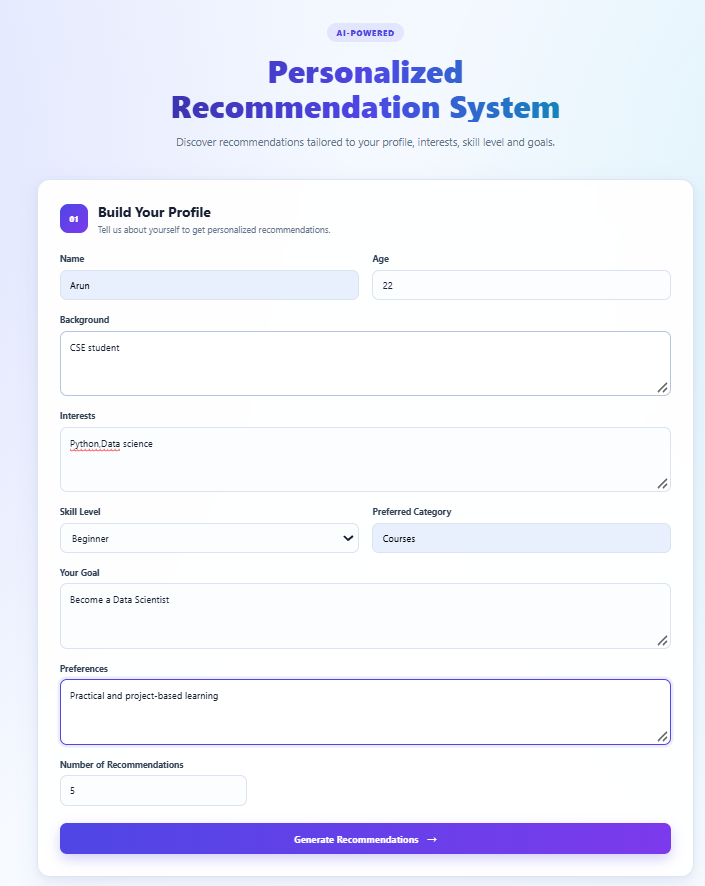
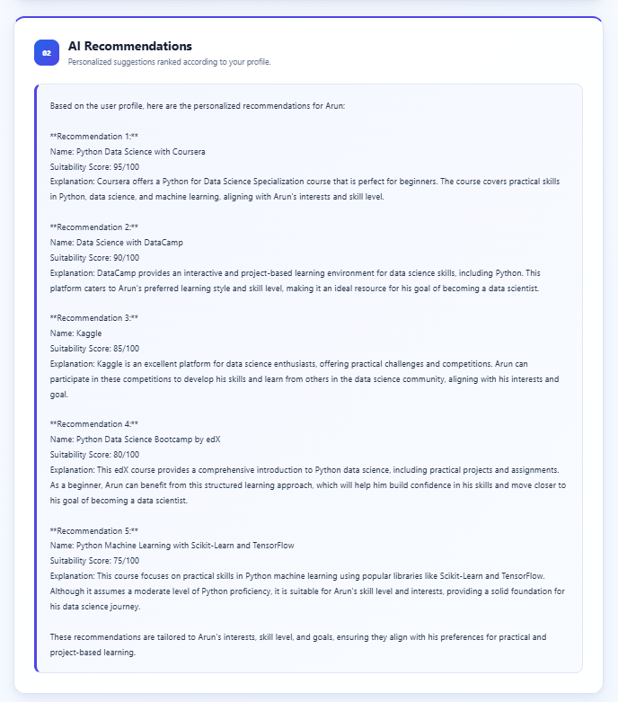
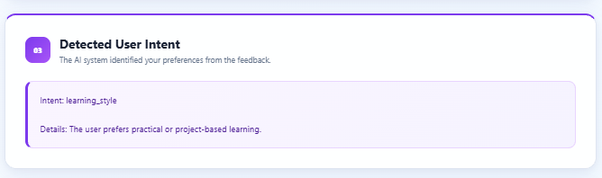
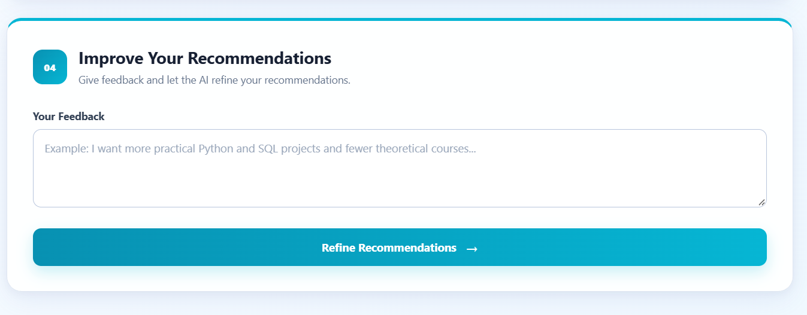

# 🎯 Personalized Recommendation System

An AI-powered personalized recommendation system built using **Python, Flask, Ollama, and Llama 3.2**.

The system analyzes user profiles, interests, skill levels, goals, and preferences to generate personalized recommendations and refine them based on user feedback.

## ✨ Features

- 👤 User Profile Analysis
- 🎯 Personalized Recommendation Generation
- 📊 Suitability Scoring and Ranking
- 💡 AI-generated Recommendation Explanations
- 🧠 User Intent Detection
- 🔄 Feedback-based Recommendation Refinement
- 🤖 Local LLM Integration using Ollama
- 🌐 Flask Web Application
- 🎨 Interactive and Responsive UI

## 🛠️ Technologies

- Python
- Flask
- Ollama
- Llama 3.2
- HTML
- CSS

## 📁 Project Structure

```text
Personalized-Recommendation-System/
├── screenshots/
│   ├── userinput.png
│   ├── output.png
│   ├── detectUserintent.png
│   └── improverec.png
├── static/
│   └── style.css
├── templates/
│   └── index.html
├── app.py
├── requirements.txt
├── .gitignore
└── README.md
```
📸 Screenshots
👤 User Profile Input

🎯 Personalized Recommendations

🧠 User Intent Detection

🔄 Refined Recommendations

